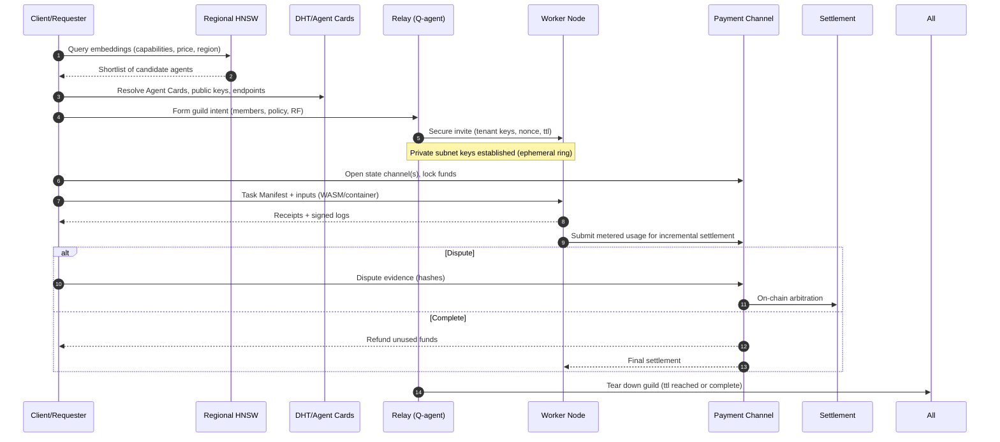

# ZeroState — Hybrid P2P Network Architecture

This document outlines a practical, buildable hybrid architecture: P2P-first edges, regional relays, and a resilient backbone. It also shows overlays for discovery, routing, compute, storage, and payments.

> Assumption: Using brand "ZeroState" for now. If you pick a different name, we’ll update.

## High-level topology

```mermaid
flowchart TB
  %% Layers
  subgraph Edge[Edge Peers]
    E1[Phone]
    E2[Laptop]
    E3[IoT/Robot]
  end

  subgraph Region[Regional Relays / Edge Cloud]
    direction TB
    R1[Relay PoP A\n(libp2p, Q-routing, caches)]
    R2[Relay PoP B\n(HNSW shard, state channels)]
  end

  subgraph Backbone[Backbone Nodes]
    direction TB
    B1[Archival Storage\n(IPFS/Filecoin gateways)]
    B2[GPU Pools\n(Containers/WASM bridge)]
    B3[Consensus Zones\n(Tendermint/HotStuff)]
  end

  subgraph Anchors[Bootstrap & Epoch Anchors]
    A1[Boot/DHT Seeds]
    A2[Chain Anchors]
  end

  %% Overlays
  subgraph Overlays[Overlays]
    direction LR
    DHT[DHT (Kademlia)\nIdentity & pointers]
    HNSW[Semantic Overlay\nRegional HNSW shards]
    PAY[Payment Overlay\nState Channels + Settlement]
    CONS[Consensus Overlay\nZones as-needed]
    PRIV[Private Subnets\nEphemeral Tenant Rings]
  end

  %% Basic connectivity
  E1 <-- QUIC/TLS --> R1
  E2 <-- QUIC/TLS --> R1
  E3 <-- QUIC/TLS --> R2
  R1 <-- Anycast/Backhaul --> R2
  R1 <-- High-throughput --> Backbone
  R2 <-- High-throughput --> Backbone

  %% Anchoring and bootstrap
  E1 -. DHT join .-> A1
  E2 -. DHT join .-> A1
  R1 -. anchor hashes .-> A2
  B1 -. anchor hashes .-> A2

  %% Overlay relations
  Edge --- DHT
  Region --- HNSW
  HNSW --> DHT
  PAY --> CONS
  PRIV -.-> DHT

  %% Data/Compute paths
  E1 ==> R1 ==> B2
  E2 ==> R2 ==> B1
```

## Guild lifecycle (ephemeral secure subnets)



## Design choices (TL;DR)

- Transport: libp2p over QUIC/TLS, NAT traversal (ICE), mDNS for LAN.
- Identity: DIDs with signed Agent Cards (JSON-LD) stored via DHT pointers.
- Discovery: Regional HNSW shards for embeddings; DHT resolves identities and endpoints.
- Routing: P2P default; relays host Q-routing agents to optimize next-hop under latency/failure/cost.
- Compute: WASM sandbox on all nodes; container bridge for GPU tasks on backbone.
- Storage: IPFS for immutable artifacts; Filecoin/cloud for redundancy; CRDTs for mutable docs.
- Payments: State channels for off-chain micro-settlement; on-chain only for disputes/finality.
- Privacy: Private tenant rings (ephemeral DHT K-buckets) for guilds; opt-in telemetry.

## Sizing hints (initial)

- Edge neighbors: 10–20 peer connections; relays handle thousands.
- Replication: RF=3 regional default; RF=5 global for critical artifacts; erasure coding 8-of-12 for large datasets.
- Kademlia params: k≈20 bucket size; α≈3 concurrency.

## Interfaces to define next

- Agent Card schema v0 (JSON-LD + signatures)
- Task Manifest schema v0 (capabilities, constraints, SLAs)
- Q-routing relay API (metrics in, policy out)
- State channel settlement messages (open, update, dispute, close)

```
Status: draft v0.1
```
