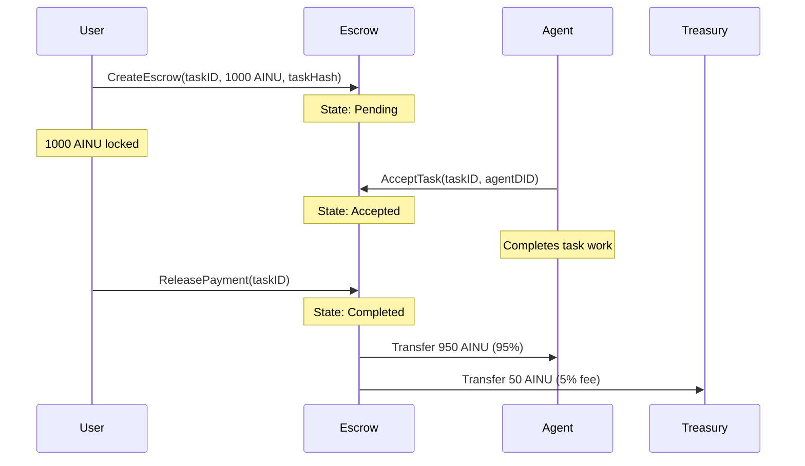
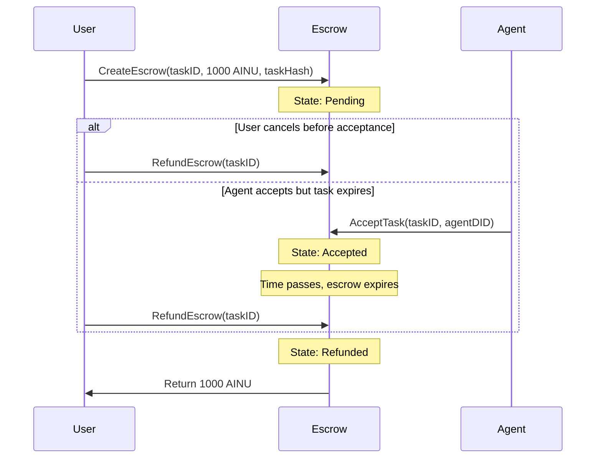
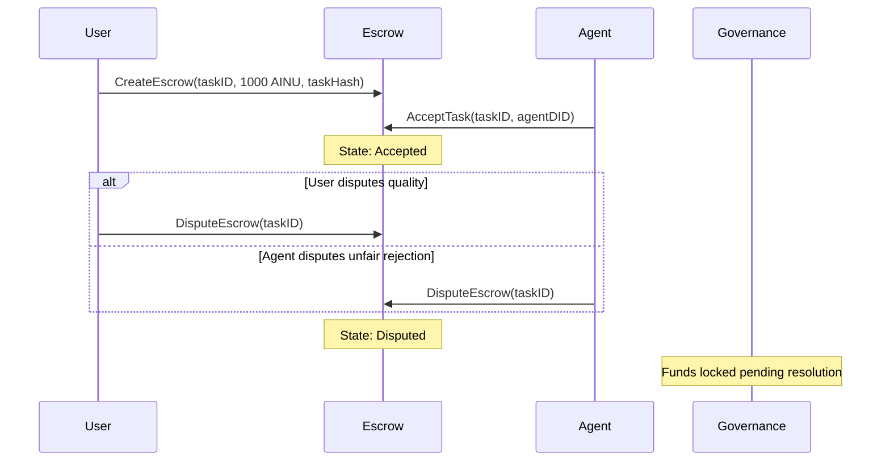

# Escrow Payment Lifecycle Documentation

This document describes the complete payment lifecycle implementation for the Ainur Protocol escrow system, including state transitions, error handling, and client integration.

## Overview

The escrow payment system provides trustless payment settlement for task-based work in the Ainur marketplace. It ensures that:
- Users' funds are safely locked until task completion
- Agents can be confident they'll be paid for completed work
- Disputes can be resolved through on-chain governance
- All operations are transparent and auditable

## State Machine

### Escrow States

```
┌─────────────┐    create_escrow()     ┌─────────────┐
│   Initial   │ ──────────────────────→│   Pending   │
│   (None)    │                        │             │
└─────────────┘                        └─────────────┘
                                              │
                                              │ accept_task()
                                              ↓
                                       ┌─────────────┐
                                       │   Accepted  │
                                       │             │
                                       └─────────────┘
                                              │
                        ┌─────────────────────┼─────────────────────┐
                        │                     │                     │
               release_payment()      refund_escrow()      dispute_escrow()
                        │                     │                     │
                        ↓                     ↓                     ↓
                ┌─────────────┐       ┌─────────────┐       ┌─────────────┐
                │  Completed  │       │  Refunded   │       │  Disputed   │
                │             │       │             │       │             │
                └─────────────┘       └─────────────┘       └─────────────┘
```

### State Descriptions

1. **Pending**: Escrow created, waiting for agent acceptance
   - User has locked funds in escrow
   - Any agent with valid DID can accept
   - User can refund anytime before expiration
   - Automatically refundable after expiration

2. **Accepted**: Agent has accepted the task
   - Funds remain locked
   - Only user can release payment
   - Only user or agent can dispute
   - Refundable after expiration by anyone

3. **Completed**: Payment successfully released to agent
   - Net amount transferred to agent
   - Protocol fee transferred to treasury
   - Terminal state - no further transitions

4. **Refunded**: Escrow refunded to user
   - Full amount returned to user
   - Terminal state - no further transitions

5. **Disputed**: Dispute raised, awaiting governance resolution
   - Funds locked until governance decision
   - Terminal state for client (governance handles resolution)

## Client Implementation

### Go RPC Client Methods

The `EscrowClient` provides complete payment lifecycle functionality:

#### Transaction Methods

```go
// Create escrow with task details and amount
func (ec *EscrowClient) CreateEscrow(
    ctx context.Context,
    taskID [32]byte,
    amount uint64,
    taskHash [32]byte,
    timeoutBlocks *uint32
) error

// Agent accepts task assignment
func (ec *EscrowClient) AcceptTask(
    ctx context.Context,
    taskID [32]byte,
    agentDID string
) error

// User releases payment to agent (success path)
func (ec *EscrowClient) ReleasePayment(
    ctx context.Context,
    taskID [32]byte
) error

// Refund escrow to user (cancellation/timeout)
func (ec *EscrowClient) RefundEscrow(
    ctx context.Context,
    taskID [32]byte
) error

// Raise dispute (user or agent)
func (ec *EscrowClient) DisputeEscrow(
    ctx context.Context,
    taskID [32]byte
) error
```

#### Query Methods

```go
// Get complete escrow details
func (ec *EscrowClient) GetEscrow(
    ctx context.Context,
    taskID [32]byte
) (*EscrowDetails, error)

// Get just the escrow state (lightweight query)
func (ec *EscrowClient) GetEscrowState(
    ctx context.Context,
    taskID [32]byte
) (EscrowState, error)

// Get all escrows created by user
func (ec *EscrowClient) GetUserEscrows(
    ctx context.Context,
    userAccount AccountID
) ([][32]byte, error)

// Get all escrows accepted by agent
func (ec *EscrowClient) GetAgentEscrows(
    ctx context.Context,
    agentDID DID
) ([][32]byte, error)
```

## Payment Flows

### Successful Task Completion



### Task Cancellation/Refund



### Dispute Resolution



## Error Handling

### Validation Rules

The client and pallet enforce comprehensive validation:

#### CreateEscrow Validation
- ✅ Amount must be > 0
- ✅ Amount must not exceed max escrow limit
- ✅ TaskID must be unique (no existing escrow)
- ✅ User must have sufficient balance
- ✅ Timeout blocks must be > 0 if specified

#### AcceptTask Validation
- ✅ Escrow must exist and be in Pending state
- ✅ Must not be expired
- ✅ Agent DID must be valid and active
- ✅ Agent DID length must be within bounds

#### ReleasePayment Validation
- ✅ Only escrow creator can release
- ✅ Escrow must be in Accepted state
- ✅ Must have assigned agent

#### RefundEscrow Validation
- ✅ Pending state: Only creator can refund
- ✅ Accepted state: Anyone can refund if expired
- ✅ Cannot refund Completed/Refunded/Disputed escrows

#### DisputeEscrow Validation
- ✅ Only user or assigned agent can dispute
- ✅ Escrow must be in Accepted state

### Error Types

```rust
pub enum Error<T> {
    EscrowAlreadyExists,     // TaskID already has escrow
    EscrowNotFound,          // TaskID not found
    InsufficientBalance,     // User lacks required balance
    AmountTooLarge,          // Exceeds max escrow amount
    InvalidEscrowState,      // Wrong state for operation
    NotEscrowCreator,        // Only creator can perform action
    NotAssignedAgent,        // Only assigned agent can perform action
    InvalidAgentDid,         // DID validation failed
    EscrowExpired,           // Operation requires non-expired escrow
    EscrowNotExpired,        // Operation requires expired escrow
    TooManyUserEscrows,      // User escrow limit reached
    TooManyAgentEscrows,     // Agent escrow limit reached
    ArithmeticOverflow,      // Mathematical operation overflow
}
```

## Integration with BlockchainService

The escrow client is integrated into the `BlockchainService` with:

- **Circuit Breaker**: Automatic failure detection and recovery
- **Retry Logic**: Exponential backoff for transient failures
- **Metrics Collection**: Performance and error tracking
- **Structured Logging**: Comprehensive operation logging
- **Context Handling**: Proper timeout and cancellation support

### Usage Example

```go
// Initialize blockchain service
service, err := NewBlockchainService(endpoint, keystoreSecret, logger)
if err != nil {
    return err
}
defer service.Close()

// Get escrow client
escrowClient := service.Escrow()
if escrowClient == nil {
    return errors.New("blockchain service disabled")
}

// Execute payment lifecycle
taskID := [32]byte{...}
amount := uint64(1000000000000) // 1 AINU
taskHash := [32]byte{...}

// 1. Create escrow
err = escrowClient.CreateEscrow(ctx, taskID, amount, taskHash, nil)
if err != nil {
    return fmt.Errorf("failed to create escrow: %w", err)
}

// 2. Check state
state, err := escrowClient.GetEscrowState(ctx, taskID)
if err != nil {
    return fmt.Errorf("failed to get escrow state: %w", err)
}
fmt.Printf("Escrow state: %s\n", state)

// 3. Accept task (as agent)
err = escrowClient.AcceptTask(ctx, taskID, agentDID)
if err != nil {
    return fmt.Errorf("failed to accept task: %w", err)
}

// 4. Release payment (as user, after task completion)
err = escrowClient.ReleasePayment(ctx, taskID)
if err != nil {
    return fmt.Errorf("failed to release payment: %w", err)
}
```

## Testing

### Unit Tests

The implementation includes comprehensive unit tests covering:

- ✅ State constant validation
- ✅ Parameter validation logic
- ✅ State transition validation
- ✅ Error handling scenarios
- ✅ Context cancellation/timeout
- ✅ Performance benchmarks

### Integration Testing

For full integration testing, you would need:

1. **Running Substrate Node**: Test blockchain with escrow pallet
2. **Test Accounts**: Funded accounts with DIDs
3. **Real Transactions**: End-to-end payment flows
4. **Event Validation**: Verify correct event emission
5. **Cross-Pallet Integration**: DID validation, registry integration

Example integration test flow:
```bash
# Start test node
cargo build --release
./target/release/solochain-template-node --dev --tmp

# Run integration tests
go test -v -tags=integration ./escrow_integration_test.go
```

## Security Considerations

1. **Fund Safety**: Funds are locked in escrow, protected by pallet validation
2. **Access Control**: Only authorized parties can execute operations
3. **State Validation**: Strict state machine enforcement prevents invalid transitions
4. **Timeout Protection**: Automatic refund capability prevents fund locking
5. **Fee Calculation**: Protected against overflow/underflow in fee computation
6. **Dispute Resolution**: Governance-based resolution for complex disputes

## Performance Characteristics

- **Transaction Finality**: 6-second average block time
- **Gas Costs**: Fixed weight for all escrow operations
- **Storage Efficiency**: Compact SCALE encoding for state storage
- **Query Performance**: O(1) lookup for escrow details
- **Batch Operations**: Client supports batch transaction submission

## Future Enhancements

Potential improvements for future versions:

1. **Multi-milestone Payments**: Support for partial payments at milestones
2. **Automatic Completion**: Time-based automatic payment release
3. **Partial Refunds**: Support for partial refunds in dispute resolution
4. **Dynamic Fees**: Market-based fee adjustment
5. **Cross-chain Support**: Integration with other blockchain networks
6. **Advanced Dispute Resolution**: AI-assisted dispute analysis